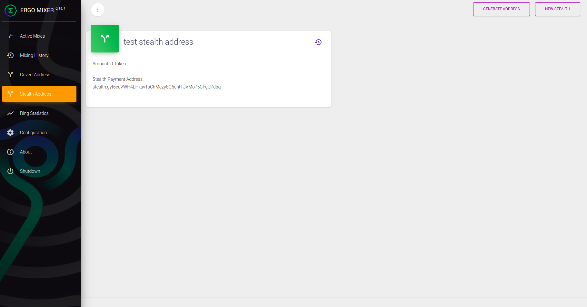
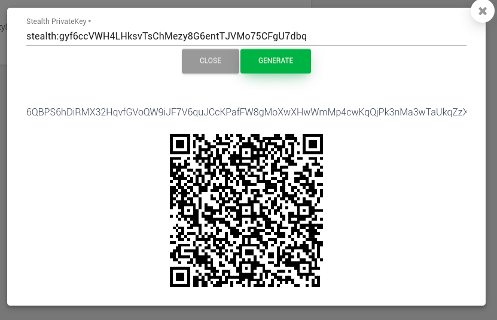
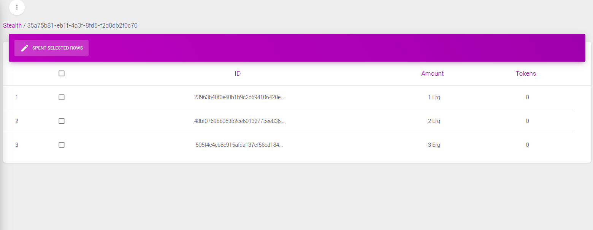
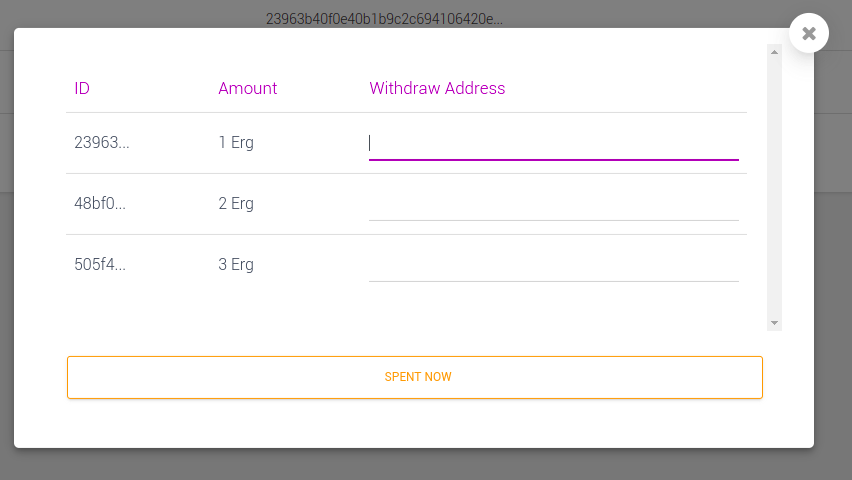

# Contents
- What is Stealth Address?
- Problem and Solution
- Ergo Mixer with stealth address feature
- ScreeShots
- Future of the project
- Thanks

# What is Stealth Address?
According to "Kushti": 
> Another solution for improving privacy is using stealth addresses. A stealth address preserves recipient privacy without per-transaction interaction needed (so receiver published an address e.g. on its website, and then sender can obtain some unique one-time address from it). This could be useful for privacy-preserving commerce, private donations and crowdfunding campaigns etc.

In other words, a stealth address is used when you want to hide your exact amount of entrance. you can pass a public key to people and they compile a stealth contract and send some Ergs to the contract address. On the other hand, the receiver can prove the contract and collect the Ergs.

## Example 
think of when you want to put a donation address on your website or etc
in this case, everybody can see your donation address transactions on the blockchain; in case you want privacy for the donation amount you get, till now there were no easy-to-use solutions for this purpose. 
one solution is to generate a new donation address for every user and save the addresses somewhere but by stealth address you can provide your public key to everyone and then they can generate a stealth address and fund you and you can scan the blockchain and found your stealth address utxo boxes and collect fund from them. nobody can't find your stealth address on the blockchain unless they have your secret key so your privacy is preserved using this solution also you don't need to generate a new address for everyone.

# Problem and Solution
The hard part of stealth addresses is finding your stealth address and collecting their fund, cause you need to scan the blockchain and found every stealth address that exists in the blockchain and checks that this is yours or someone else managing this could be a complete headache so we decided to solve the problem of finding your stealth address and also withdraw their fund to every address you want with easy-to-use UI.

# Ergo Mixer with stealth address feature
this is an improved version of ergo mixer with contain stealth address feature. you can find the main version [here](https://github.com/ergoMixer/ergoMixBack).

## about the project
The major project for stealth address is a customized version of ergo scanner, which you can find it [here](https://github.com/aragogi/scanner).
We take part in the ErgoHack3 and this is our result. Hope this can be part of the main mixer.

We discuss stealth address and its benefits in the [stealth scanner project](https://github.com/aragogi/scanner#stealth-address-scanner).
In this project, we embed our scanner into the mixer with some new features.

1. Scanner model and database re-designed and imported into the mixer.
2. We implement some APIs (talk about them later).
3. Some new services were added to the mixer to run the scanner and do the payments.

As you can see, we add these routes to the mixer:

| method  | route                                 | usage  |
| :---:   |  :---                                 | :---   |
| POST    | /stealth                              | by sending a name for stealth, we generate a new secret and a new stealth address for you |
| GET     | /stealth                              | you can get all of your stealth addresses with stealth name and the value you earned |
| GET     | /stealth/address/:pk                  | you can generate a stealth payment address by sending and stealth address to this route  |
| GET     | /stealth/:stealthId                   | you can get one specific stealth address and the value earned |
| GET     | /stealth/:stealthId/getUnspentBoxes   | get all of your unspent boxes for given stealthId  |
| POST    | /stealth/:stealthId/spend             | set spend address for each of your boxes to spend them  |

I write these routes here to tell you what is a new feature of the mixer. Also, there is a UI for them. We customize the mixer UI and add some pages so you can use the stealth address inside the mixer.
## UI
the UI gives you the ability to generate stealth addresses by providing a public key (both in raw hex and QR code for mobile users) and also managing your existing stealth addresses (in case you are a receiver). 

### Managing stealth addresses
The scanner that embeds in the mixer backend scans for your every boxes corresponding to your stealth addresses and add them to the database and the UI gives you the ability to name every stealth address so you can manage them more comfortably you can see the history of every utxo box you have in stealth address and withdraw every box you want to a specific address.

the stealth address page is based on the covert address page so everyone that is familiar with the covert address UI can use and understand it easily.

## ScreenShots
- Stealth Address Menu 

- Generating Stealth Address 

- Stealth Address Boxes Menu 

- Withdraw Menu 

## Future of the project
- [ ] improve the scanner side and make it more simplified and efficient.
- [ ] Adding the restore feature to the stealth scanner, which the user can import the secret and find related boxes.
- [ ] Integration with wallets.

## Thanks
**anon2020s** We appreciate you so much that even you was busy working on mixer 4.0.0 release you share your time with us.
